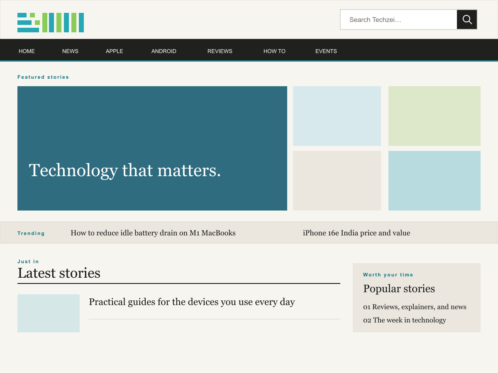

# Techzei Magazine Theme



Techzei Magazine Theme is a lightweight WordPress block child theme for [Techzei](https://techzei.com/). It keeps the direct, image-led character of the previous magazine site while using modern WordPress templates, responsive images, and the Site Editor instead of a page builder.

It is deliberately small: no external fonts, front-end framework, analytics, ad slots, or bundled page-builder code. The theme is designed to be fast to load, straightforward to host, and easy for editors to maintain.

## Highlights

The current theme uses **Reading Charcoal** (`#575555`) for post/page content, with darker headings. Change it through the Site Editor palette and Post Content block styles. Existing saved Global Styles and explicitly colored blocks take precedence. Prose links are underlined, including internal links, and long strings wrap within the reading column.

- Editorial homepage with lead coverage, supporting stories, a compact trending rail, latest stories, and a discovery sidebar.
- Responsive desktop and mobile article layouts, including sticky navigation, logo-first mobile header, and a compact search control.
- Article essentials: visible breadcrumbs, optional How To/Explainer table of contents, featured image, author profile, sharing, post navigation, related stories with thumbnails, tags, and native comments.
- Topic-aware article discovery: current-topic stories, latest stories, an optional newsletter CTA slot, freshness-limited reviews, and compact follow links.
- Correct responsive image crops for hero, tile, feed, related-story, and sidebar contexts.
- Yoast-friendly metadata behavior: when Yoast SEO is active, it owns titles, descriptions, canonical URLs, and social cards. A small server-rendered fallback is used only when no supported SEO plugin is active.
- Legacy Valenti content compatibility for `column`, `alert`, `button`, `pullquote`, `hr`, and `attention` shortcodes.
- Footer navigation, RSS, social links, Techzei’s original India mark, and the site credit.
- Curated local Gadget Icons in topic navigation, with no frontend icon-library or CDN dependency.

## Requirements

- WordPress 6.7 or newer
- PHP 7.4 or newer
- [Twenty Twenty-Five](https://wordpress.org/themes/twentytwentyfive/) installed as the parent theme

Twenty Twenty-Five must be installed, but it does not need to be active. This theme is a child theme and WordPress loads the parent automatically.

## Install or update

1. Back up the current site and keep the previously working theme ZIP for rollback.
2. In **Appearance → Themes**, install Twenty Twenty-Five if it is not already present.
3. Upload the release ZIP from **Appearance → Themes → Add New → Upload Theme**.
4. Activate **Techzei Magazine Theme**.
5. Clear page, object, host, and CDN caches.
6. If this is the first installation, regenerate thumbnails so older uploads receive the `techzei-hero`, `techzei-tile`, and `techzei-feed` crops.

For the complete release checklist, see [DEPLOYMENT.md](DEPLOYMENT.md).

## First-time setup

Open **Appearance → Editor** after activation and review these items:

1. **Site Logo** — upload the real Techzei logo. The theme falls back to the site title only when no logo is configured.
2. **Header and footer links** — confirm all category, company, RSS, and social destinations. The included links assume Techzei’s current root-domain permalink structure.
3. **Templates** — if WordPress shows an old saved Site Editor version rather than the theme files, open the template options menu and choose **Clear customizations**.
4. **Homepage** — if a legacy page-builder assignment remains on the Home page, set that page’s template to **Default**.
5. **SEO** — keep Yoast SEO active and configure titles, descriptions, social images, and the organization profile there.

## Techzei Settings

Use **Appearance → Techzei Settings** for theme behaviour: sticky header modes, header search and Topics visibility, homepage feature/feed/headline behaviour, default article layout, breadcrumbs, TOC, metadata/share/related controls, related-story selection mode, and article-sidebar discovery counts/categories including mobile visibility. The page uses one namespaced option and its reset action changes only that option. Its read-only diagnostics show active/parent theme versions and saved Site Editor template customisations with inspect links.

Use **Appearance → Editor → Styles** for colours, font families, typography, content/wide widths, and spacing. Keep the Site Editor as the owner of the logo, menus, footer copy, India mark, template composition, and section labels. Use the post editor’s **Template** control for a one-off article layout. See [the 3.1.0 settings contract](docs/3.1.0-settings.md), [the 3.2.0 settings additions](docs/3.2.0-settings.md), and [the 3.4.0 discovery notes](docs/3.4.0-discovery.md) for the full inventory and precedence rules.

### Article discovery and single-post chrome

The sidebar on the standard article template is ordered as **More in this topic**, **Latest stories**, optional **Newsletter CTA**, **Latest reviews**, and optional **Follow Techzei**. More in this topic uses the post’s Yoast primary category when it is valid, otherwise its deepest WordPress category; it excludes the current post and prefers cards with featured images. The newsletter slot is disabled by default and ships empty: turn it on only after selecting a provider, then add that provider’s block in the Site Editor.

With the Breadcrumbs setting on, the theme renders Yoast’s breadcrumb output when Yoast SEO is active, including whatever breadcrumb/schema settings Yoast manages. Without Yoast, the visible fallback is deliberately plain HTML and does not emit a duplicate `BreadcrumbList` schema. The automatic TOC appears only for How To or Explainer posts that contain at least three H2/H3 headings; it uses native `<details>` so it works without JavaScript.

On mobile articles, the optional sticky share dock keeps WhatsApp first while preserving the normal in-flow share row. It appears only when sharing and at least one destination are enabled.

## Legacy article support

Older Techzei posts created with Valenti shortcode content remain readable without modifying their database content. The theme supports:

| Legacy shortcode | Current output |
| --- | --- |
| `[column]` | Responsive two-, three-, and four-column content that stacks on mobile |
| `[alert]` | Accessible coloured notice |
| `[button]` | Styled, safe external/internal link button |
| `[pullquote]` | Editorial pull quote |
| `[hr]` | Horizontal divider |
| `[attention]` | Highlighted attention notice |

Posts published before 2024, or posts containing these shortcodes, automatically use the denser legacy article treatment when Automatic legacy styling is enabled. Editors can choose **Article with sidebar** or **Article without sidebar** for individual posts; explicit post templates take precedence over the site default.

## Image performance

The theme registers three WordPress image sizes:

| Size | Dimensions | Used for |
| --- | ---: | --- |
| `techzei-hero` | 1440 × 810 | Homepage lead and article featured images |
| `techzei-tile` | 720 × 540 | Homepage supporting cards |
| `techzei-feed` | 560 × 360 | Feeds, related stories, and sidebars |

The primary article image loads eagerly with high priority. Card and list imagery uses native lazy loading, async decoding, and size hints so browsers request appropriately sized files. Regenerate existing thumbnails once after activation; new uploads receive these crops automatically.

## Project structure

```text
techzei-magazine-theme/
├── assets/             # Article styles, interaction script, India mark, and curated SVG icons
├── inc/                # Setup, editorial components, SEO fallback, shortcodes
├── parts/              # Header, footer, article discovery, TOC, sharing, author, related stories
├── templates/          # Front page, single post, archives, pages, search, 404
├── functions.php       # Small theme bootstrap
├── style.css           # Theme metadata and global presentation
└── theme.json          # Editor palette, spacing, typography, template parts
```

The newsletter CTA template part is intentionally empty and disabled by default; it is a Site Editor insertion point once a provider is selected. The theme retains the original India PNG at `assets/images/india-techzei.png` and the public `techzei_tt5_*` integration names.

The selected topic SVGs come from [Gadget Icons](https://www.npmjs.com/package/gadget-icons), version 0.4.0, and are redistributed under the MIT license included at `assets/icons/LICENSE.txt`.

### Translation and compatibility

Visitor-facing PHP strings use the `techzei-magazine-theme` text domain, while
template strings remain native block content so WordPress can extract and
translate them without taking ownership away from the Site Editor. The small
header/ticker fallback labels are localized server-side and in the deferred
interaction data. No translation plugin or remote service is required. The
optional runtime suite in [tests/README.md](tests/README.md) exercises the
cache, TOC, shortcode, settings-invalidation, and image-filter contracts.

## Development and releases

The source folder must keep this exact name: `techzei-magazine-theme`. WordPress expects the folder at the root of the upload ZIP, alongside `style.css`.

Before publishing a release:

1. Update the version in `style.css`, `README.txt`, and `CHANGELOG.md`.
2. Check PHP syntax, JavaScript syntax, and `theme.json` validity.
3. Build a ZIP containing one top-level `techzei-magazine-theme/` folder.
4. Verify the ZIP contents and test it on a staging site with Twenty Twenty-Five installed.
5. Check the homepage, a current post, a legacy-shortcode post, an archive, search, 404, desktop navigation, and mobile navigation/search.

### GitHub Releases

Publishing a GitHub Release automatically runs the release workflow. It checks out the release tag, confirms that the tag matches the `Version` field in `style.css`, builds a clean WordPress upload ZIP, verifies its structure, and attaches it to the release.

Use matching version tags, for example `v3.4.1` for theme version `3.4.1`. The resulting release asset is named `techzei-magazine-theme-3.4.1.zip` and contains exactly one top-level `techzei-magazine-theme/` folder.

The current development metadata is still **3.4.1** and is marked unreleased
in the changelog. `Tested up to: 6.8` remains deliberate: production is
currently running WordPress 7.1.1, but this repository does not yet have a
repeatable WordPress 7.1 test environment, so 7.1 support is not claimed.

## License

GPL-2.0-or-later. See [LICENSE.txt](LICENSE.txt).

Built for Techzei. Footer credit: [jashjacob.com](https://jashjacob.com/).
